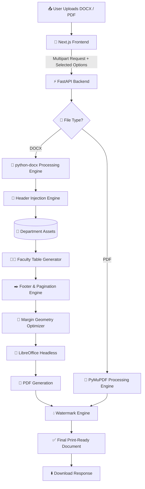

# 🚀 LabDoc AI 2.0

### *Automated Document Formatting Platform for Practical Files*

### 📱 Mobile-First • 📄 Supports DOCX & PDF • 🏫 Supports All 11 TCET Departments

### ⚡ Generate official print-ready practical files in seconds with automatic headers, faculty tables, watermarks and footers..

---

---

# 🎥 Demo

  <video src="https://github.com/user-attachments/assets/1e964672-7c13-4dc2-8dcd-706832215e1e" width="280" controls></video>

> ⚡Upload → Select Department → Process → Download

---

# 💡 Why I Built LabDoc AI

Every engineering student knows the last-minute rush before getting a practical file printed.

The write-up is complete, but before it can be printed, there's still one frustrating task left—manually formatting the document.

Adding official headers, watermarks, faculty tables, footers, and making sure everything is perfectly aligned can easily take several minutes. It's repetitive, time-consuming, and creates unnecessary panic just before practical checking.

After facing this process again and again, I decided to automate it instead of repeating the same manual work every time.

**LabDoc AI** is built specifically for **TCET students**, allowing them to upload their practical file, choose the required formatting options, and generate an official print-ready document in just a few seconds.

> The goal was simple: spend less time formatting documents and more time focusing on practical work.

---

## 🌟 Key Features

LabDoc AI has evolved from a simple formatting utility into a complete **document automation platform** built specifically for TCET students.

---

### 🏫 1. Supports 11 Departments at TCET

LabDoc AI now supports **all 11 engineering departments** at TCET.

Simply choose your department and the processing engine automatically applies the correct official formatting resources.

Supported Departments:

- 💻 Computer Engineering (COMP)
- 🌐 Information Technology (IT)
- 🧠 AI & Data Science (AIDS)
- 🤖 AI & Machine Learning (AIML)
- 🛡️ Cyber Security
- 📡 Internet of Things (IoT)
- 📡 Electronics & Telecommunication (E&TC)
- ⚡ Computer Science & Engineering (E&CS)
- ⚙️ Mechanical Engineering
- 🔧 Mechatronics (Additive Manufacturing)
- 🏗️ Civil Engineering

---

### 📱 2. Supports DOCX or PDF

Upload either a DOCX or PDF practical file.

The processing pipeline automatically selects the appropriate engine and generates a print-ready document while preserving the original content.

### 📱 3. Official Formatting

Automatically applies official department headers, faculty tables, watermarks and custom footers without requiring any manual formatting.

### 📱 4. Mobile-First Experience

Designed to work seamlessly on mobile devices, allowing students to prepare practical files directly from their phones whenever required.

# 🔥 Core Engine Features

### 📏 Smart Header Injection Engine

The document engine safely parses the internal DOCX XML structure, removes outdated or incompatible headers, and injects the latest **official TCET department header** without disturbing the existing document layout.

**Highlights**

* Automatic legacy header replacement
* Department-wise dynamic header routing
* Margin geometry compensation to prevent content shifting
* Preserves original document formatting

---

### 👨‍🏫 Smart Faculty Table Generator

Faculty approval tables are generated automatically based on the selected department.

Instead of manually creating or editing tables before printing, LabDoc AI inserts the **official department-specific faculty table** with proper alignment and spacing.

**Highlights**

* Official TCET faculty table layouts
* Department-aware table selection
* Automatic placement without affecting document content

---

### ✒️ Intelligent Footer & Pagination Engine

Generate professional document footers with a single click.

The engine dynamically expands the document canvas and inserts:

`Name • Class • Roll Number • Auto Page Number`

while maintaining proper spacing and preventing content overlap.

**Highlights**

* Dynamic page numbering
* Automatic margin adjustment
* Layout-safe footer injection

---

### 💧 Smart Watermark Processing

The watermark engine intelligently analyses document pixels before applying the official college watermark.

Instead of simply overlaying an image, the engine preserves document readability while maintaining professional print quality.

**Highlights**

* Intelligent RGB threshold detection
* 45% translucent watermark rendering
* Maintains crisp document text
* Print-friendly output

---

### 📄 Cloud PDF Processing Pipeline

LabDoc AI automatically converts and processes documents using a Dockerized LibreOffice runtime.

The pipeline supports both DOCX and PDF workflows while handling large files reliably.

**Highlights**

* Reliable DOCX → PDF conversion
* Dockerized headless LibreOffice
* Supports DOCX and PDF workflows
* Built-in compatibility handling for complex documents

---

## ⚡ Average Processing Time

| Operation | Average Time |
|-----------|-------------:|
| DOCX → DOCX Formatting | **3–5 sec** |
| PDF → PDF Processing | **5–10 sec** |
| DOCX → PDF Conversion | **15–20 sec** |

> Processing time may vary depending on document size and system load.

---

## 📊 Early Impact (Version 1)

| Metric | Result |
|--------|-------:|
| 👥 Unique Users | **164+** |
| 📄 Page Views | **365+** |
| 📢 LinkedIn Impressions | **2,300+** |
| 🏫 Departments Supported (V2) | **11** |

## 🚀 From Version 1 to Version 2

LabDoc AI started as a small automation tool built for a single department.

After receiving feedback from early users, the platform was completely re-engineered into Version 2, expanding support to all 11 engineering departments at TCET while introducing automatic faculty tables, intelligent footer generation, improved document processing, mobile-first workflows and a scalable backend architecture.

The project evolved from solving one classroom problem into a campus-wide document automation platform.

# ⚙️ Advanced System Architecture

# 🛠️ Technology Stack

  

| Layer | Technologies |
|--------|--------------|
| **Frontend** | Next.js, React, Tailwind CSS, Shadcn UI, Lucide Icons |
| **Backend** | FastAPI, Uvicorn, Python 3.10+ |
| **Document Processing** | python-docx, PyMuPDF (fitz), Pillow (PIL) |
| **Document Conversion** | LibreOffice Headless |
| **Deployment** | Vercel, Docker, Render |

## 🧩 Engineering Challenges

Building LabDoc AI required solving more than document formatting.

Some of the engineering challenges included:

- Scaling from 1 department to 11 departments
- Deploying Dockerized LibreOffice on Render's free tier
- Optimizing memory usage during document conversion
- Supporting both DOCX and PDF processing pipelines
- Maintaining layout accuracy while injecting headers, faculty tables and footers

---

# 👨‍💻 Developed By

**Shivam Vishwakarma**

🚀 3rd Year Computer Engineering Student (TCET)

💻 Full Stack Developer

⚡ Passionate about building real-world software that solves practical problems through automation.

---

# 🌐 Connect With Me

- 💼 **LinkedIn:** https://www.linkedin.com/in/shivam-vishwakarma-932166371/

- 🌍 **Live Demo:** https://lab-doc-ai.vercel.app/

---

### ⭐ If you found this project interesting, consider giving it a Star!

Your support motivates me to keep building practical software that solves real-world problems.

