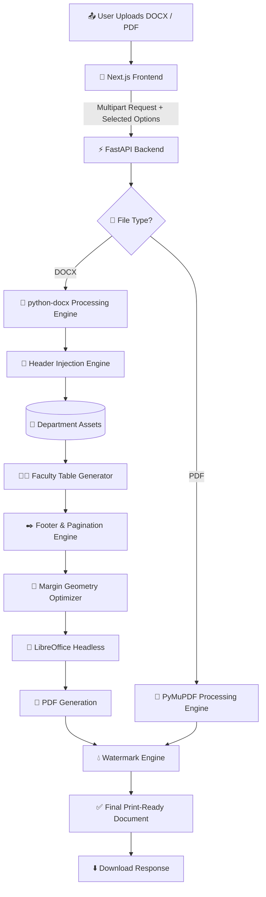

# 🚀 LabDoc AI 2.0

### *Automated Practical File Formatting Platform for Engineering Students*

  
  
  
  
  

### ⚡ Transform practical files into official TCET print-ready documents in seconds.

### 📱 Mobile-First • 🏫 Supports All 11 TCET Departments • 📄 Header • Faculty Table • Watermark • Footer

---

# ✨ Preview (Watch it in Action)

  <video src="YOUR_LATEST_VIDEO_LINK_HERE" width="280" controls></video>

> ⚡ Upload your practical file → Select your department → Choose formatting options → Download a print-ready document in seconds.

---

# 🚨 The Story Behind LabDoc AI

Two months ago, I was standing outside a stationery shop with a practical file that was technically complete—but still not ready to print.

The experiment was finished.

The content was correct.

But I was still spending valuable time manually fixing headers, watermarks, and formatting just minutes before submission.

That 15-minute frustration made me ask one simple question:

> **Why are engineering students still doing this manually?**

So I built a small automation tool for a few classmates.

Honestly, I expected around **10–15 students** to use it.

Instead, within **48 hours**, over **164 students** tried it, generating **365+ page views** and **2,300+ LinkedIn impressions**.

That response made one thing clear.

The problem wasn't just mine.

It was shared by students across the college.

The only limitation?

Version 1 supported only the **Computer Engineering department**.

So LabDoc AI was completely rebuilt from the ground up.

Today, **LabDoc AI 2.0** supports **all 11 engineering departments at TCET**, allowing students to prepare official practical files directly from their phones in just a few seconds.

No more last-minute formatting panic.

Just **Upload → Select Options → Process → Download.**

---

## 🌟 What's New in LabDoc AI 2.0

LabDoc AI has evolved from a simple formatting utility into a complete **document automation platform** built specifically for TCET students.

---

### 🏫 1. College-Wide Multi-Department Support

LabDoc AI now supports **all 11 engineering departments** at TCET.

Simply choose your department and the processing engine automatically applies the correct official formatting resources.

Supported Departments:

- 💻 Computer Engineering (COMP)
- 🌐 Information Technology (IT)
- 🧠 AI & Data Science (AIDS)
- 🤖 AI & Machine Learning (AIML)
- 🛡️ Cyber Security
- 📡 Internet of Things (IoT)
- 📡 Electronics & Telecommunication (E&TC)
- ⚡ Computer Science & Engineering (E&CS)
- ⚙️ Mechanical Engineering
- 🔧 Mechatronics (Additive Manufacturing)
- 🏗️ Civil Engineering

---

### 👨‍🏫 2. Smart Faculty Table Generator

No more manually creating or editing faculty approval tables.

LabDoc AI automatically inserts the **official department-specific faculty table**, ensuring documents follow the required college format without additional editing.

---

### ✒️ 3. Automatic Footer & Pagination

Instead of manually typing your details on every page, simply enable **"Add Document Footer"** and enter your information once.

The engine automatically expands the document canvas and inserts:

`Name | Class | Roll Number | Auto Page Number`

without disturbing the existing document layout.

---

### 📱 4. Mobile-First Experience

LabDoc AI is designed to work seamlessly on mobile devices.

The interface follows a **Progressive Disclosure** workflow that guides users step-by-step:

1. Upload your file
2. Select your department
3. Choose formatting options
4. Process & download

This allows students to generate print-ready documents directly from their phones—even while standing outside the print shop.

# 🔥 Core Engine Features

### 📏 Smart Header Injection Engine

The document engine safely parses the internal DOCX XML structure, removes outdated or incompatible headers, and injects the latest **official TCET department header** without disturbing the existing document layout.

**Highlights**

* Automatic legacy header replacement
* Department-wise dynamic header routing
* Margin geometry compensation to prevent content shifting
* Preserves original document formatting

---

### 👨‍🏫 Smart Faculty Table Generator

Faculty approval tables are generated automatically based on the selected department.

Instead of manually creating or editing tables before printing, LabDoc AI inserts the **official department-specific faculty table** with proper alignment and spacing.

**Highlights**

* Official TCET faculty table layouts
* Department-aware table selection
* Automatic placement without affecting document content

---

### ✒️ Intelligent Footer & Pagination Engine

Generate professional document footers with a single click.

The engine dynamically expands the document canvas and inserts:

`Name • Class • Roll Number • Auto Page Number`

while maintaining proper spacing and preventing content overlap.

**Highlights**

* Dynamic page numbering
* Automatic margin adjustment
* Layout-safe footer injection

---

### 💧 Smart Watermark Processing

The watermark engine intelligently analyses document pixels before applying the official college watermark.

Instead of simply overlaying an image, the engine preserves document readability while maintaining professional print quality.

**Highlights**

* Intelligent RGB threshold detection
* 45% translucent watermark rendering
* Maintains crisp document text
* Print-friendly output

---

### 📄 Cloud PDF Processing Pipeline

LabDoc AI automatically converts and processes documents using a Dockerized LibreOffice runtime.

The pipeline supports both DOCX and PDF workflows while handling large files reliably.

**Highlights**

* Reliable DOCX → PDF conversion
* Dockerized headless LibreOffice
* Supports DOCX and PDF workflows
* Built-in compatibility handling for complex documents

---

## ⚡ Average Processing Time

| Operation | Average Time |
|-----------|-------------:|
| DOCX → DOCX Formatting | **3–5 sec** |
| PDF → PDF Processing | **5–10 sec** |
| DOCX → PDF Conversion | **15–20 sec** |

> Processing time may vary depending on document size and system load.

---

## 📊 Early Impact (Version 1)

| Metric | Result |
|--------|-------:|
| 👥 Unique Users | **164+** |
| 📄 Page Views | **365+** |
| 📢 LinkedIn Impressions | **2,300+** |
| 🏫 Departments Supported (V2) | **11** |

# ⚙️ Advanced System Architecture

# 🛠️ Technology Stack

  

| Layer | Technologies |
|--------|--------------|
| **Frontend** | Next.js, React, Tailwind CSS, Shadcn UI, Lucide Icons |
| **Backend** | FastAPI, Uvicorn, Python 3.10+ |
| **Document Processing** | python-docx, PyMuPDF (fitz), Pillow (PIL) |
| **Document Conversion** | LibreOffice Headless |
| **Deployment** | Vercel, Docker, Render |

---

# 👨‍💻 Developed By

**Shivam Vishwakarma**

🚀 3rd Year Computer Engineering Student (TCET)

💻 Full Stack Developer

⚡ Passionate about building real-world software that solves practical problems through automation.

---

# 🌐 Connect With Me

- 💼 **LinkedIn:** https://www.linkedin.com/in/shivam-vishwakarma-932166371/

- 🌍 **Live Demo:** https://lab-doc-ai.vercel.app/

---

### ⭐ If you found this project interesting, consider giving it a Star!

Your support motivates me to keep building practical software that solves real-world problems.

