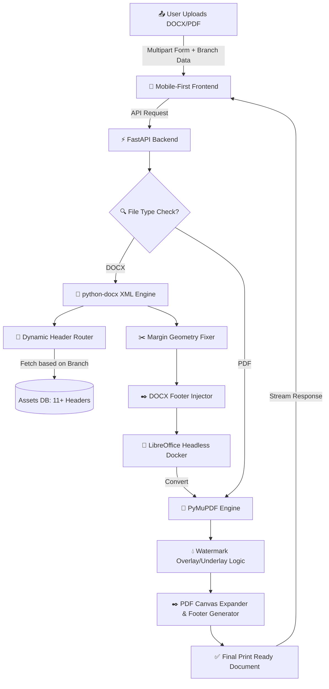

<div align="center">

# 🚀 LabDoc AI 2.0

### *AI-Powered Automated Document Processing Infrastructure for Engineering Students*

<p align="center">
  <a href="https://lab-doc-ai.vercel.app/">
    
  </a>
  
  
  
  
</p>

### ⚡ Transform messy practical files into print-ready PDFs in 20 seconds.

### 📱 Mobile-First • 🏫 11+ Departments Supported • 📄 Dynamic Headers & Footers

</div>

---

## ✨ Preview (Watch it in Action)

<div align="center">
  <video src="https://github.com/user-attachments/assets/1668e5dc-3250-45a1-becc-938236b7b356" width="280" controls></video>
</div>

> ⚡ Upload your `.docx` from your phone → Select your Branch → LabDoc AI auto-fixes formatting → Get **college-ready PDF in 20 seconds!**

---

# 🚨 The Genesis: The 10:40 AM Panic

Every engineering student knows this exact struggle.

It’s **10:40 AM**. Submission is at **11:00 AM**. The queue for the college lab dot-matrix printer is a mile long.
The only backup? Running to the local stationery shop to print.

But local shops only have **plain A4 paper**, not the official pre-printed **"Thakur Sheets"** with college logos.

Rushing to print here brings **massive roadblocks**:

1. 🧩 **The Manual Struggle:**
   Manually inserting the college watermark, aligning it without breaking Word formatting, and exporting as PDF burns **10–15 precious minutes**.

2. 🕰️ **Outdated Formats:**
   Standard experiment templates still carry the old 2019 headers.

3. 📝 **Repetitive Typing:**
   Typing out Name, Class, and Roll Number on the footer of every single page manually.

---

# 🚀 The Evolution: LabDoc AI 2.0

What started as a quick fix for the "10:40 AM panic" has now evolved into a **College-Wide Document Processing Engine**.

Instead of booting up a laptop, you can stand right outside the stationery shop, use your phone, and get a **print-ready PDF in just 20 seconds**.

---

## 🌟 What's New in V2.0? (The Game Changers)

### 🏢 1. Massive Multi-Department Expansion

LabDoc AI is no longer just for Computer Engineering. It now features dynamic backend routing that automatically injects the **official headers** for **11 distinct engineering branches** based on user selection:

* 💻 Computer Engineering (COMP)
* 🌐 Information Technology (IT)
* 🧠 AI & Data Science (AIDS)
* 🤖 AI & Machine Learning (AIML)
* 🛡️ Cyber Security
* 📡 Internet of Things (IoT)
* 📡 Electronics & Telecom (E&TC)
* ⚡ Computer Science & Electronic (E&CS)
* ⚙️ Mechanical Engineering
* 🔧 Mechatronics (Additive Mfg)
* 🏗️ Civil Engineering


---

### ✒️ 2. Auto-Footer Generation & Pagination

No more typing your details on every page.

Toggle **"Add Document Footer"**, enter your details once, and the engine dynamically calculates the document canvas, expands the bottom margins, and injects:

`[Name] | [Class] | [Roll No] | Pg: [Auto-Incrementing Page Number]`

...safely without breaking any existing text!

---

### 📱 3. "Premium Glassmorphism" Mobile UI

Rebuilt the frontend using the **"Progressive Disclosure" (Glow & Lock)** UI pattern.

Users are guided smoothly:

1. Upload file
2. Department dropdown glows
3. Everything else remains securely locked
4. Select department → Smooth unlock of all formatting toggles

---

# 🔥 Core Engine Features

### 📏 Smart Header Injection

* Removes legacy / broken headers safely by parsing deep `.docx` XML
* Injects standardized 2023 college-approved headers based on branch
* Seamlessly compensates geometry (Top/Bottom Margins) to prevent text overflow

---

### 💧 Pixel-Perfect Watermark Engine

* Intelligent RGB thresholding `>240`
* Applies **45% translucent watermark underlay**
* Keeps text **100% crisp black** without layout breaking

---

### 📄 Cloud PDF Conversion

* Dockerized **headless LibreOffice**
* Reliable `.docx → .pdf` auto-conversion
* Handles heavy & compressed files (Built-in WPS rescue logic)

---

# ⚙️ Advanced System Architecture



---

# 🛠️ Tech Stack

| Layer      | Technology                                            |
| ---------- | ----------------------------------------------------- |
| Frontend   | React, Next.js, Tailwind CSS, Shadcn UI, Lucide Icons |
| Backend    | FastAPI, Uvicorn, Python 3.10+                        |
| Processing | python-docx, PyMuPDF (fitz), Pillow (PIL)             |
| Conversion | LibreOffice Headless CLI                              |
| Deployment | Docker (Render), Vercel                               |

---

# 💻 Local Setup

## 🔹 Clone Repository

```bash
git clone https://github.com/vshivam1729/LabDoc-AI.git
cd LabDoc-AI
```

## 🔹 Backend Setup

```bash
cd backend
python -m venv venv
```

### ▶️ Activate Virtual Environment

* Windows:

  ```bash
  venv\Scripts\activate
  ```

* Linux / Mac:

  ```bash
  source venv/bin/activate
  ```

### ▶️ Install Dependencies & Run

```bash
pip install -r requirements.txt
uvicorn main:app --reload
```

---

## 🔹 Frontend Setup

```bash
cd frontend
npm install
npm run dev
```

---

# 🌟 Why This Project Stands Out

This is not just a CRUD application. It demonstrates:

* 🧠 Real-world Product Thinking
* 📐 Deep Document Engineering
* 📱  UX Design
* ⚙️ Robust Backend Architecture

---

# 👨‍💻 Developed By

**Shivam Vishwakarma** <br>
🚀 2nd-year Computer Engineering Student <br>
💻 Full Stack Developer <br>
⚡ Building real-world scalable solutions

---

# 🌐 Connect With Me

* 💼 LinkedIn: [Shivam Vishwakarma](https://www.linkedin.com/in/shivam-vishwakarma-932166371/)
* 🔴 Live Demo: [LabDoc AI](https://lab-doc-ai.vercel.app/)

---

⭐ If this project impressed you, please star the repo!
Your one ⭐ motivates more real-world builds. 🚀
